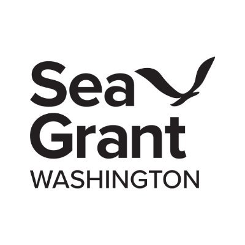
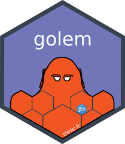

```{=html}
<style>
.footer {
  text-align: right;
  padding: 10px;
}
.footer img {
  width: 50px; /* Adjust as needed */
  height: auto;
  margin-left: 10px;
}
</style>
```
```{r setup, include = FALSE}
```

##  {.tabset}

### **Welcome**

::: columns
::: {.column width="55%"}
#### **Summary**

Welcome to the Upstream User Guide! [Upstream](https://upstream-cloud-run-jcypjvvn7a-uw.a.run.app) is an intuitive and user-friendly R Shiny application designed for barrier culvert restoration planning in Western Washington. This guide serves as both a technical manual and a comprehensive overview of the app's functionalities, including its core features: Explore, Suggest, Custom, and Learn.

Upstream is more than just a tool; it's a solution crafted to simplify complex planning processes in environmental restoration. Whether you're a seasoned expert or new to the field of barrier culvert restoration, this guide will help you harness the full potential of Upstream.

In this guide, you'll find detailed explanations of each feature:

-   Explore: Delve into data and visualize culvert attributes across various boundaries.

-   Suggest: Receive tailored restoration plans based on your specific constraints and budget.

-   Custom: Create and assess the impact of your own set of restoration projects.

-   Learn: Learn about how to utilize the app its development.

Our aim is to provide you with all the information you need to make informed decisions and streamline your planning process. With helpful tips, step-by-step instructions, and links to related resources, this guide is your comprehensive companion in utilizing Upstream effectively.

To get started, select a tab above for detailed insights into each of Upstream's unique features. Dive in and discover how Upstream can enhance your restoration planning experience!
:::

::: {.column width="5%"}
:::

::: {.column width="40%"}
 
:::
:::

---

::: footer
 
:::

### **Explore**

#### **Overview**

::: columns
::: {.column width="55%"}
The Explore feature is designed to visualize and plot culvert attributes across various administrative and hydrological boundaries.

------------------------------------------------------------------------

#### **Getting Started**

Choose the 'Explore' tile on the Upstream landing page or select the corresponding tab. This feature automatically shows the entire WDFD culvert inventory for western Washington, updated to the latest version in Upstream. It filters out natural barriers and any barriers situated upstream of natural barriers.
:::

::: {.column width="5%"}
:::

::: {.column width="40%"}

:::
:::

------------------------------------------------------------------------

#### **Map Call-Outs**

::: columns
::: {.column width="55%"}
Zoom into your area of interest and click on a culvert to access detailed information. The callouts provide insights into:

-   The culverts Site ID
-   Passability
-   Potential Fish Species
-   Total Upstream Habitat
-   Habitat to next barrier (marginal)
-   Estimated Construction Cost
-   Ownership
-   The number of culverts corrected downstream by WSDOT
-   The number of culverts corrected downstream by other than WSDOT
-   Weather WSDOT Plans to correct that particular barrier
-   The date the culvert was surveyed
:::

::: {.column width="5%"}
:::

::: {.column width="40%"}

:::
:::

------------------------------------------------------------------------

#### **Area, Subarea, and Ownership**

::: columns
::: {.column width="55%"}
To refine the inventory data, use the dropdown menu to select Water Resource Inventory Areas (WRIAs) of interest. For multiple selections, ensure 'All WRIAs' is deselected. Similarly, selecting specific ownership types will filter the maps and figures accordingly.
:::

::: {.column width="5%"}
:::

::: {.column width="40%"}

:::
:::

------------------------------------------------------------------------

#### **Select Variables For Plotting**

This section allows you to plot variables as a histogram or scatterplot. For instance, to analyze the relationship between the cost of culvert repairs and the length of blocked habitat:

1.  Set Plot Type to "Scatterplot".
2.  Choose "Cost" for the X-axis variable.
3.  Select "Full Habitat Length" for the Y-axis.
4.  For style, use "Cost" as the fill color.

Adjust the plot's appearance using the jitter sliders.


------------------------------------------------------------------------

#### **Submit and Visualization**

::: columns
::: {.column width="35%"}
Click "Submit" to generate two outputs:

1.  An interactive map showcasing culverts within the selected area, subarea, and ownership.
2.  A scatter plot illustrating the chosen characteristics.

Note: The 'Select Variable for Map' and 'Plot Fill Color' options enhance the visualization of the selected variable on both the map and scatter plot.
:::

::: {.column width="5%"}
:::

::: {.column width="60%"}

:::
:::

------------------------------------------------------------------------

::: footer
 
:::

### **Suggest**

#### **Overview**

::: columns
::: {.column width="55%"}
The Suggest feature returns a restoration plan that maximizes habitat, given the users budget, project area, and other constraints.

------------------------------------------------------------------------

#### **Getting Started**

To initiate the Suggest feature on the Upstream platform, simply select your project area, define your budget, and choose the culvert ownership types. This process, accessible in the Suggest section, is straightforward and user-friendly, allowing you to quickly set the parameters for your habitat restoration plan.
:::

::: {.column width="5%"}
:::

::: {.column width="40%"}

:::
:::

------------------------------------------------------------------------

#### **Enter Budget**

::: columns
::: {.column width="55%"}
As with Upstream's Explore feature, WRIA's, sub-areas, and ownership type can be customized in Suggest to meet the needs of the user through a series of drop-down menus (see "Explore" tab section for more on this). For example, on the right we allow for Upstream to suggest culverts of all ownership types in all sub-areas within the Chambers-Clover WRIA only.

Once an these fields are populated, provide the budget available for repairs in US dollars---such as 80000 in the example to the right.
:::

::: {.column width="5%"}
:::

::: {.column width="40%"}

:::
:::

------------------------------------------------------------------------

#### **Submit**

Without additional selections (see below), clicking "Submit" will provide two products:

1.  A map highlighting, in blue, barrier(s) that are estimated to unlock the most habitat for the user defined budget. selections here are based on [Recent research](https://www.sciencedirect.com/science/article/abs/pii/S0006320722002634) on regional repair costs, and uniform habitat quality.

<p align="center">


</p>

2.  A report, matching projects on the map, that provides the summed habitat by fish species (if known), that is estimated to be repaired, along with estimated cost per barrier id within the plan.

<p align="center">


</p>

------------------------------------------------------------------------

#### **Already Planned / Will Complete**

::: columns
::: {.column width="55%"}
In addition to spatial and administrative constraints, users can pass new information and customization to their Suggest analysis. The Already Planned / Will Complete field allows users to include the IDs of culverts they have either recently completed (but passibility is not reflected in the apps data), or have planned and budgeted for those repairs separately. In either case, including the culvert will remove the cost of its repair in the analysis, assume it is now passable, and suggest additional barriers within the users budget as before. Additionally, the added Planned/Completed culverts will be shown as associated habitat in the map but ignored in the new report.
:::

::: {.column width="5%"}
:::

::: {.column width="40%"}

:::
:::

Note: If you don't know the culvert id, but know their physical locations, simply navigate to those points on the map, click, and copy/paste the id from their call out into the Already Planned / Will Complete field.Once added, click the submit button again.

------------------------------------------------------------------------

#### **Example Results**

::: columns
::: {.column width="55%"}
Map Results:

Including the two culverts to the southwest as already planned / completed, and leaving budget the same, suggests a new third culvert to the northeast, the map indicates potential habitat gains in blue with areas that will remain blocked in red.
:::

::: {.column width="5%"}
:::

::: {.column width="40%"}

:::
:::

Report Results:

Only the unlocked habitat and cost of the new suggestion is given. Note that this particular stream had no species listed, but still reports the total linial gain.


------------------------------------------------------------------------

#### **Habitat Quantity Definition**

Habitat quantity is a critical metric in environmental assessment and can be quantified in terms of length, area, or volume. By default, length is used as the primary measure.


*Note:* For area and volume calculations, bankfull width and depth are utilized as outlined in Bieger et al. 2015.

------------------------------------------------------------------------

#### **Objective**

The Objective feature in Upstream provides a more comprehensive analysis of habitat quality. When selecting 'Weighted Attributes', the system incorporates various habitat quality metrics, building upon the chosen Habitat Quantity Metric.

This feature allows users to assign weights to different land use types within a 100-meter buffer surrounding the habitat. These land use categories, derived from the National Landcover Dataset, include urban, agricultural, and natural areas. This weighting system enables users to make localized assessments of habitat quality based on land use.

Additionally, the 'Ideal Habitat Temperature' option allows users to factor in temperature conditions, further refining the habitat quality analysis.


------------------------------------------------------------------------

#### **Cost**

In the Cost section of Upstream, users have the flexibility to input specific financial details for their projects. This feature is particularly useful for those who have precise cost information at their disposal.

::: columns
::: {.column width="35%"}
-   **Provide Mean Project Cost:** Users can enter the average cost of either the design phase or the construction phase of their culvert projects. This input is invaluable for those who have detailed, project-specific financial data.

-   **Default Modelled Cost Estimates:** For users without specific cost data, Upstream offers a default option that utilizes modelled cost estimates. These estimates are based on a comprehensive analysis of regional data and provide a reliable approximation for project budgeting.
:::

::: {.column width="5%"}
:::

::: {.column width="60%"}

:::
:::

This dual approach to cost estimation ensures that users can tailor the financial aspects of their habitat restoration plans according to the level of detail they have, ensuring both accuracy and flexibility in project planning.

------------------------------------------------------------------------

::: footer
 
:::


### **Custom**

#### **Overview**

::: columns
::: {.column width="55%"}
The Custom feature on Upstream allows for detailed habitat restoration planning. It enables users to select specific culverts by ID, in addition to setting budget, project area, and ownership types. This feature is ideal for targeted restoration efforts.

------------------------------------------------------------------------

#### **Getting Started**

To use Custom, start by choosing your project area, budget, and culvert ownership types, similar to the Suggest feature. The unique aspect here is selecting specific culverts by their IDs for a more focused approach. The Custom feature then generates a report detailing habitat gains by salmon species and overall, along with the estimated cost of the plan.
:::

::: {.column width="5%"}
:::

::: {.column width="40%"}

:::
:::

------------------------------------------------------------------------

::: footer
 
:::

### **Learn**

#### **Overview**

::: columns
::: {.column width="55%"}
The Learn feature is your comprehensive resource for understanding Upstream. It offers detailed background information about the app, insights into its development, and helpful guidance on how to navigate and utilize its features effectively.

------------------------------------------------------------------------

#### **Getting Started**

To complement this user manual, we are developing a video tutorial that will provide a visual and interactive guide to Upstream. Your feedback is invaluable to us, so please don't hesitate to reach out with suggestions or questions to further enrich your learning experience.
:::

::: {.column width="5%"}
:::

::: {.column width="40%"}

:::
:::

------------------------------------------------------------------------

::: footer
 
:::

### **Data and Resources**

#### **Comprehensive Data Sources**

Upstream utilizes a variety of data sources to provide accurate and up-to-date information. Below is a list of these sources, detailing their specific contributions to our app.

------------------------------------------------------------------------

**Culvert (Points) Data**

1.  [**WDFD Barrier Inventory**](https://fortress.wa.gov/dfw/public/PublicDownload/habitat/FishPassage/)**:**

    -   Last updated for app use: 9/1/23.

    -   Excludes natural barriers and barriers upstream of natural barriers.

    -   Additional details and web maps available [here](https://wdfw.wa.gov/species-habitats/habitat-recovery/fish-passage/assessment).

2.  [**WSDOT Planned and Corrected Barrier Inventories**](https://gisdata-wsdot.opendata.arcgis.com/search?q=fish%20passage)**:**

    -   Includes Fish Passage Delivery Plan Sites for 2021-2023, 2023-2025, and 2025-2027.

    -   Statewide data on corrected barriers can be found [here](https://gisdata-wsdot.opendata.arcgis.com/datasets/WSDOT::wsdot-fish-passage-corrected-barriers-statewide/explore).

------------------------------------------------------------------------

**Streams Data**

1.  [**NHDPlus HR**](https://www.usgs.gov/national-hydrography/nhdplus-high-resolution)**:**

    -   Provides core flowline, catchment data, and WDB HUC boundaries.

    -   Data acquired using [nhdplusTools](https://doi-usgs.github.io/nhdplusTools/).

------------------------------------------------------------------------

**Temperature and Land Use Data**

-   Temperature values are sourced from NHDPlus.

-   Land use data is derived from the [National Landcover Dataset](https://www.mrlc.gov/data), specifically the 2019 version, offering detailed insights into the surrounding environments of habitats.

------------------------------------------------------------------------

**Cost Estimates**

1.  [**Van Deynze et al 2022**](https://www.sciencedirect.com/science/article/abs/pii/S0006320722002634)**:**

    -   Provides modelled cost estimates for project planning.

------------------------------------------------------------------------

**Legal Boundaries**

1.  [**Injunction Boundary**](https://geo.wa.gov/datasets/fe5bc6ad319144478326336b04ab619f/about)**:**

    -   Outlines the case area for U.S. District Court Injunction No. C70-9213.

------------------------------------------------------------------------

#### **App Development and Source Code**

::: columns
::: {.column width="7%"}

:::

::: {.column width="3%"}
:::

::: {.column width="90%"}
**Golem Framework:** The Upstream app was developed using the [Golem](https://thinkr-open.github.io/golem/) Shiny application framework. Golem provides a structured and efficient approach for building complex Shiny applications, enhancing maintainability and scalability.
:::
:::

::: columns
::: {.column width="7%"}

:::

::: {.column width="3%"}
:::

::: {.column width="90%"}
**Source Code on GitHub:** The source code for Upstream is available on [GitHub](https://github.com/), promoting transparency and collaboration within the community. This open-source approach allows users to review, contribute, or adapt the code for their own projects.
:::
:::


---

::: footer
 
:::
